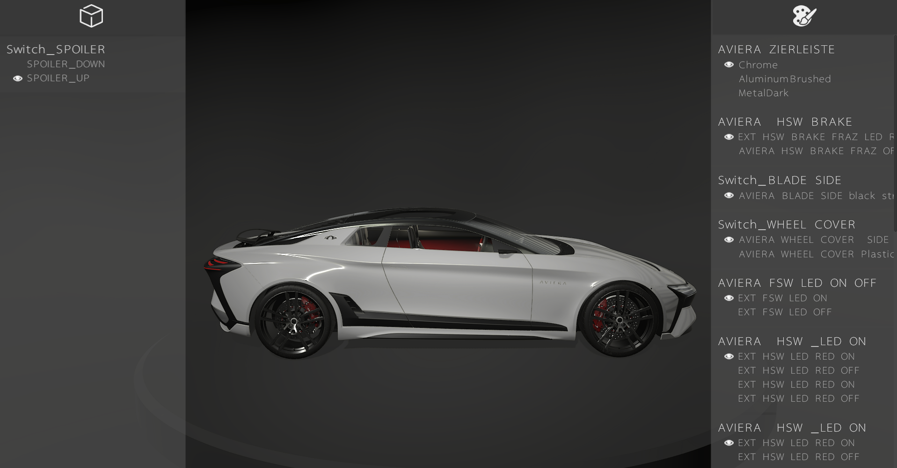

# VRED2Unity-Template-Configuration

Automotive samples for [PiXYZ Plugin for Unity](https://www.pixyz-software.com/plugin/).

## Car Configurator Sample

*Model not included*

For the 2019.1, PiXYZ introduced VRED scenes import in Unity. This comes with a set of methods and components to handle switches and variant sets. This demo shows you how to use this API to list all model variants automatically, display them in a menu and select them at runtime.

The menus are generated automatically, this demo will work with any .vpb file imported with our 2019.1 PLUGIN for Unity.

## Requirements

* PiXYZ PLUGIN for Unity 2019.1 or higher
* Unity 2018.3 or higher
* VRED Pro or VRED Design binded to a valid license

## How to use

### Clone project

1. Clone this project and open it 
2. Import the PiXYZ Plugin for Unity in the project
3. Go to Edit > Preferences and set the VRED executable setting to point to your VREDPro.exe or VREDDesign.exe installation
4. We recommend to use this sample with the [Unity Measured Materials Library](https://assetstore.unity.com/packages/2d/textures-materials/unity-measured-materials-library-138814). Download it from the Asset store and then change the 'Materials' name folder to 'Resources':

### Import a .vpb file

1. Go to *PiXYZ > Import Model* and select a .vpb file. We will use the automotive sample from Autodesk (C:/ProgramData/Autodesk/VREDPro-xx.x/Examples/Automotive_Genesis.vpb)
2. Please refer to the [documentation](https://www.pixyz-software.com/documentations/html/2019.1/plugin4unity/VREDImportGroup.html) for more information on the import settings. In this tutorial we'll prefer PiXYZ mesh over VRED one. The process will take more time but the number of triangles will be significantly less important for the same visual quality. If importing the Autodesk genesis sample, you can use the material mapping table at Assets/Genesis_material_library.csv. It will override existing materials with the ones from the Measured Materials Library. Choose a Maximum mesh quality and select "Use Materials in Resources".

3. Check the root of the imported model, a Variants Manager component and a Variant Sets component should be placed there. They should match the switches and variant sets from your .vpb file
    
### Stage the model

1. Place the imported model under the rotating "platform" GameObject

2. Expand the imported animation .fbx in Assets/3DModels. Select the AnimStack element and duplicate it (CTRL+D). Select the duplicated animstack and open the Animation window (CTRL+6). Delete the animations you do not need. For the Genesis, we'll only keep the Doors animations. Drag and drop the anim stack on the GameObject containing the Animator component

### Run

The model rotates in the center of the scene and the doors are opening. Transform switches are listed in the left menu, material switches in the right one. Select the configuration you wish and enjoy!

